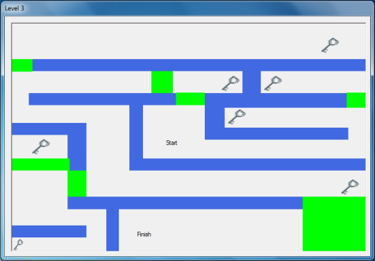

# MouseMaze

MouseMaze is an interactive game where players guide the mouse cursor through a complex maze to reach the goal. The game involves solving puzzles, avoiding obstacles, and finding the shortest path to the goal. It is designed to be both fun and challenging, suitable for players of all ages. The project is built using Visual Basic and WinForms.

## Screenshots

